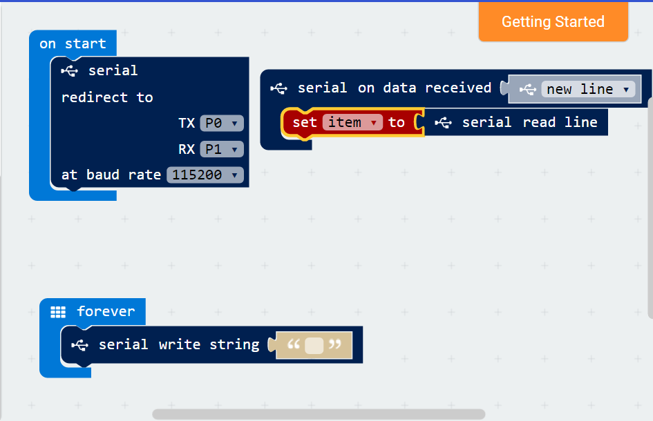

# Initial Commit

For an initial commit of interesting items for this repro

## Hardware

### targets

* <http://makecode.com> with initial interest in the micro:bit

### LoRaWAN modules

In general, rx/tx is used to communicate. However, the key issue is to ensure that p0,p1,p3 are not used as these are often used for other purposes (for example, left/right speacker and microphone to name just some). They are also analog and therefore "precious" and should be taken in consideration with Boards.

* <http://www.microchip.com/wwwproducts/en/RN2483> as the RN2483 has previous work with micro:bit
* <http://www.embit.eu/products/wireless-modules/emb-lr1272> as the RN2483 is out of stock due to new version

### Boards

* <https://github.com/ribbotson/LoRaWAN_MicroBit> carrier for both micro:bit and LoRaWAN modules
* <https://github.com/lrnzzz/RN2483-LoRa-Shield> an arduino shield that can be hooked up to a micro:bit
* prototype carriers with just leads are also available to ensure access to POC's
  * <https://www.proto-pic.co.uk/breadbit-breakout-board-for-microbit.html>
  * and others.

## Software

## target

* <https://makecode.com/defining-blocks> allows for block creation as a quick implementation
* <https://pxt.microbit.org/packages> allow for the packaging of ttn: the final aim of pxt-ttn

There is support for serial, which can possibly be reused as standard Typescript/POC with correct initialisation of TTN.

## Application

* ttn is about creating a final application based on the inputs and outputs of a target
* some easy application creation is needed.

## Reference

* <https://github.com/ribbotson/MERL-Microbit> c++ for the ribootson board.